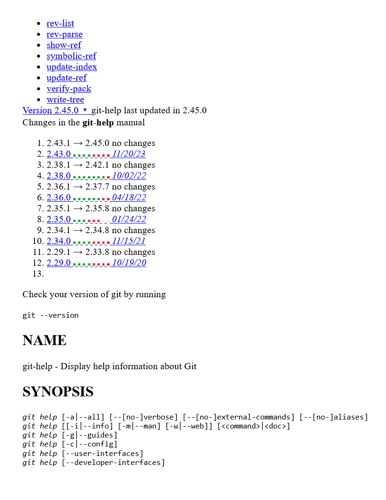

Attached images-files-printouts

Here is a ZIP attached, created from running commands:

  

"ABC" > ABC.txt

mkdir EmptyDir

mkdir Dir

mkdir Dir\SubDir

"DEF" > Dir\DEF.txt

"IJK" > .\Dir\SubDir\IJK.md

  

  

  

  

Next, an image attached file:

  

And then directly included:

  

Now, directly include but scale down to very small:

  

  

Next, a PDF printout:

  

